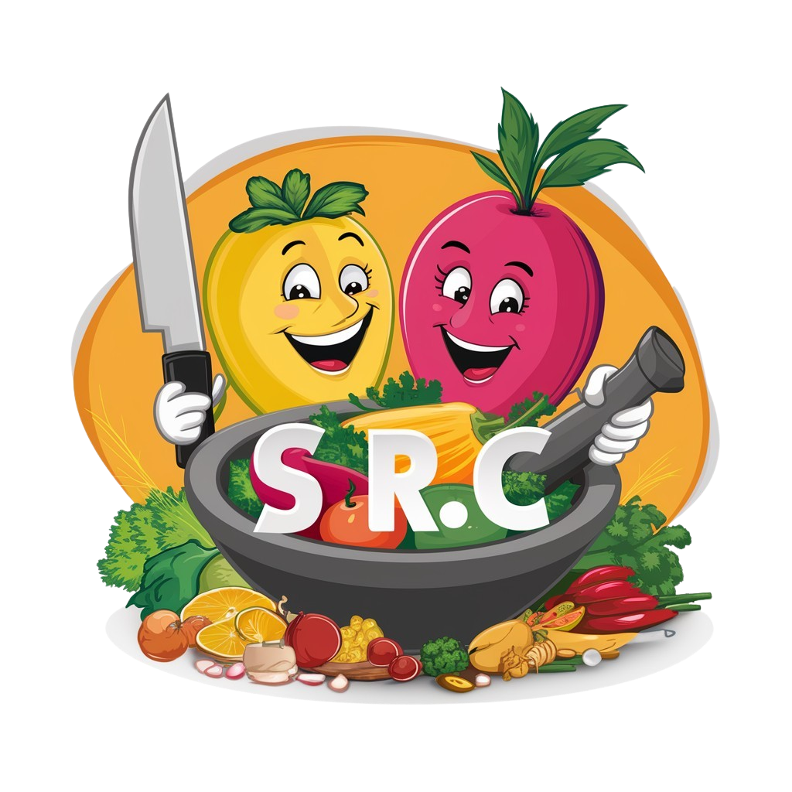

# Terrahacks 2024 Submission
Authors: Joanne Wijetunga, Timothy Yung, Pritumi Patel, Kyle Truong
 

  

## Demo Video
https://youtu.be/661ssGl4ef0

## Instructions
1. Create a Python virtual environment using `python -m venv /path/to/new/virtual/environment`
2. Run `pip i -r requirements.txt`
3. cd into 'backend' and then 'flask run' in one terminal
4. Then run 'npm run dev' in another terminal
